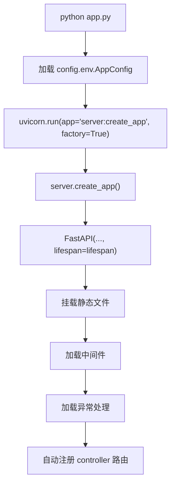
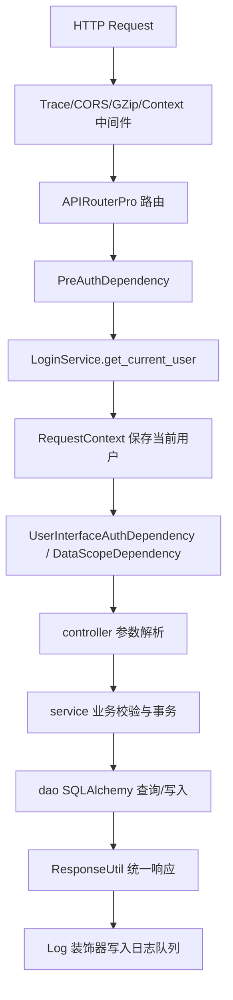

# ruoyi-fastapi-backend 后端实现逻辑阅读指南

> 这份文档用于快速熟悉 `ruoyi-fastapi-backend` 的整体实现逻辑。它不是接口使用手册，而是代码阅读地图：先告诉你从哪里进、请求怎么流、核心模块各管什么，再指出几个容易误读的实现细节。

生成时间：2026-04-16  
适用目录：`ruoyi-fastapi-backend`

## 1. 一句话总览

这是一个基于 **FastAPI + SQLAlchemy Async + Pydantic v2** 的若依风格后台服务，整体采用：

```text
controller -> service -> dao -> entity(do/vo) -> database/cache
```

同时内置了：

- JWT 登录认证、菜单权限、角色权限、数据权限。
- 参数配置、字典、验证码、登录令牌、分布式锁等缓存能力。
- 定时任务管理，底层使用 APScheduler。
- 操作日志、登录日志的异步队列落库。
- 代码生成器，支持从数据库表反向生成后端、前端、SQL 模板代码。
- AI 模型管理与流式对话，底层使用 Agno。
- 一个尚未完整暴露接口的 `module_standard` 标准文档数据模型。

特别注意：项目里很多类名仍叫 `RedisUtil`、`redis`、`RedisInitKeyConfig`，但当前实现已经把缓存兼容层换成了基于数据库表 `sys_cache` 的 `CacheStore`，不是直接连接真实 Redis。

## 2. 先读哪些文件

建议按下面顺序读，效率最高：

| 顺序 | 文件/目录 | 读它能理解什么 |
| --- | --- | --- |
| 1 | `app.py` | 启动入口，如何调用 Uvicorn。 |
| 2 | `server.py` | FastAPI 应用创建、生命周期、启动/关闭资源。 |
| 3 | `config/env.py` | `.env.*` 如何加载，应用、JWT、DB、缓存、日志配置来源。 |
| 4 | `config/database.py`、`config/get_db.py` | SQLAlchemy engine、session、Base、启动建表逻辑。 |
| 5 | `common/router.py` | 自动扫描并注册所有 `controller` 路由的机制。 |
| 6 | `common/aspect/pre_auth.py`、`interface_auth.py`、`data_scope.py` | 登录认证、接口权限、角色权限、数据权限。 |
| 7 | `utils/cache_store.py`、`config/get_redis.py` | 数据库版缓存兼容层，为什么变量名还叫 redis。 |
| 8 | `config/get_scheduler.py` | APScheduler、任务加载、分布式锁、多 worker 同步。 |
| 9 | `module_admin/service/login_service.py` | 登录、token、当前用户、菜单路由生成。 |
| 10 | 任意业务模块的 `controller/service/dao/entity` | 掌握标准 CRUD 写法，例如用户、角色、字典、参数。 |
| 11 | `module_ai`、`module_generator` | AI 与代码生成两个扩展模块。 |
| 12 | `module_standard` | 新增标准领域表模型，目前只有 DO/VO。 |

## 3. 后端目录地图

```text
ruoyi-fastapi-backend/
  app.py                         # Uvicorn 启动入口
  server.py                      # create_app 与 lifespan
  config/                        # 配置、数据库、缓存、调度器初始化
  common/                        # 通用响应模型、路由注册、认证鉴权切面、枚举常量
  exceptions/                    # 自定义异常与全局异常处理
  middlewares/                   # CORS、GZip、上下文清理、trace、演示模式
  module_admin/                  # 系统管理、系统监控、登录、缓存、日志、任务等主业务
  module_ai/                     # AI 模型管理与 AI 对话
  module_generator/              # 代码生成器
  module_standard/               # 标准文档领域模型，当前未暴露 controller/service/dao
  module_task/                   # 定时任务可调用函数示例
  sub_applications/              # 静态资源挂载
  utils/                         # 工具类：响应、分页、Excel、上传、日志、加密、模板等
  sql/                           # 初始化 SQL，包含 MySQL/PostgreSQL 版本
  alembic/                       # Alembic 迁移环境
```

## 4. 启动链路

### 4.1 从命令到应用对象

`app.py` 是入口：

```text
python app.py --env dev
```

大致流程：



`config/env.py` 会先解析命令行 `--env`，再加载对应环境文件：

- 默认：`.env.dev`
- 生产：`.env.prod`

配置分成几组：

- `AppSettings`：host、port、root_path、reload、workers、Swagger/ReDoc 开关、演示模式等。
- `JwtSettings`：JWT 密钥、算法、过期时间、缓存过期时间。
- `DataBaseSettings`：数据库类型、连接池、MySQL/PostgreSQL 方言选择。
- `RedisSettings`：保留字段，当前缓存实现没有直接使用真实 Redis。
- `LogSettings`：日志队列、Loguru、文件日志、worker 标识等。
- `GenSettings`：代码生成作者、包名、生成路径等。
- `UploadSettings`：上传目录、下载目录、允许扩展名、静态访问前缀。

### 4.2 `server.py` 的生命周期

`server.py` 是后端真正的装配中心。

启动阶段 `lifespan()` 做这些事：

1. `RedisUtil.create_redis_pool()` 创建 `CacheStore`，并赋值给 `app.state.redis`。
2. 通过 `StartupUtil.acquire_startup_log_gate()` 竞争 `app:startup:lock`。
3. 抢到锁的 worker 负责输出启动日志，并启动锁续期任务。
4. `init_create_table()` 调用 `Base.metadata.create_all` 初始化 ORM 表。
5. `RedisUtil.check_redis_connection()` 检查数据库缓存存储。
6. `RedisUtil.init_sys_dict()` 把字典加载进缓存。
7. `RedisUtil.init_sys_config()` 把参数配置加载进缓存。
8. `SchedulerUtil.init_system_scheduler()` 初始化定时任务。
9. `LogAggregatorService.consume_stream()` 以后台任务消费日志队列。

关闭阶段做这些事：

1. 取消日志聚合后台任务。
2. 取消锁续期任务。
3. 关闭缓存兼容层。
4. 关闭 APScheduler。
5. 释放 SQLAlchemy async engine。

这个设计的重点是：多 worker 场景下用 `sys_cache` 中的 `app:startup:lock` 控制只有一个 worker 负责启动调度器和输出启动日志。

## 5. 请求链路

典型受保护接口的请求路径如下：



通用层次约定：

- `controller`：声明路由、参数、依赖、权限、日志装饰器，组装响应。
- `service`：业务校验、事务提交/回滚、调用 DAO、调用缓存/调度器/文件等外部能力。
- `dao`：只做数据库访问，通常不提交事务。
- `entity/do`：SQLAlchemy ORM 表模型。
- `entity/vo`：Pydantic 请求/响应模型，字段多用 `to_camel` 别名暴露给前端。

## 6. 路由注册机制

所有 controller 不需要手动在 `server.py` include。`common/router.py` 会自动扫描：

```text
* / controller / [!_]*.py
```

然后导入模块，找到：

- `APIRouterPro` 实例：当 `auto_register=True` 时注册。
- 普通 `APIRouter` 实例：直接注册。

`APIRouterPro` 扩展了两个字段：

- `order_num`：路由注册排序，数值越小越先注册。
- `auto_register`：是否参加自动注册。

现有注册顺序大体是：

1. 登录模块
2. 验证码模块
3. 用户、角色、菜单、部门、岗位、字典、参数、公告
4. 日志、在线用户、定时任务、服务监控、缓存监控
5. 通用上传下载
6. 代码生成
7. AI 模型、AI 对话

## 7. 认证、权限、数据范围

### 7.1 登录流程

登录入口在：

```text
module_admin/controller/login_controller.py
POST /login
```

主逻辑在 `LoginService.authenticate_user()`：

1. 从缓存读取 `sys.login.blackIPList`，校验登录 IP 黑名单。
2. 检查账号锁定缓存 `account_lock:{username}`。
3. 根据系统配置 `sys.account.captchaEnabled` 判断是否校验验证码。
4. 通过 `login_by_account()` 查用户和部门。
5. 校验 bcrypt 密码。
6. 密码错误次数写入 `password_error_count:{username}`。
7. 超过 `CommonConstant.PASSWORD_ERROR_COUNT` 后写入账号锁定缓存。
8. 用户停用则拒绝登录。
9. 登录成功后生成 JWT，载荷包含 `user_id`、`user_name`、`dept_name`、`session_id`。
10. token 写入缓存 `access_token:{session_id}` 或 `access_token:{user_id}`。
11. 更新用户最后登录时间。

`AppConfig.app_same_time_login` 控制 token 存储策略：

- `True`：同一账号可多端同时登录，每个会话用独立 `session_id`。
- `False`：同一账号同一时间只保留一个登录态，用 `user_id` 作为 token key。

### 7.2 当前用户解析

受保护路由通常挂了：

```python
dependencies=[PreAuthDependency()]
```

`PreAuth` 会读取 `Authorization` 头，最终调用 `LoginService.get_current_user()`：

1. 去掉 `Bearer ` 前缀。
2. 用 JWT 密钥解码 token。
3. 查询数据库中的用户、部门、角色、岗位、菜单权限。
4. 去缓存中比对 token 是否仍有效。
5. 刷新 token 缓存过期时间，形成滑动过期。
6. 如果角色 ID 包含 `1`，赋予 `*:*:*` 超级权限。
7. 否则从菜单 `perms` 汇总权限列表。
8. 计算是否初始密码、密码是否过期。
9. 把 `CurrentUserModel` 放入 `RequestContext`。

`RequestContext` 使用 `contextvars.ContextVar` 保存当前请求中的用户和排除路由规则。`ContextCleanupMiddleware` 会在请求结束后清理，避免上下文串请求。

### 7.3 接口权限

接口权限依赖在 `common/aspect/interface_auth.py`：

- `UserInterfaceAuthDependency('system:user:list')`
- `RoleInterfaceAuthDependency('admin')`

用户权限来自 `sys_menu.perms`，超级管理员拥有 `*:*:*`。如果当前路由被 `PreAuth` 排除，权限依赖会拒绝使用，避免在未认证路由上误取当前用户。

### 7.4 数据权限

数据权限依赖在 `common/aspect/data_scope.py`：

```python
DataScopeDependency(SysUser)
```

它根据当前用户角色的 `data_scope` 生成 SQLAlchemy where 条件：

| data_scope | 含义 |
| --- | --- |
| `1` | 全部数据权限 |
| `2` | 自定义数据权限，通过 `sys_role_dept` |
| `3` | 本部门数据权限 |
| `4` | 本部门及以下数据权限 |
| `5` | 仅本人数据权限 |

生成的条件交给 DAO 拼到查询里。用户、角色、部门、AI 模型等列表/详情会使用这个机制。

## 8. 响应、异常和模型约定

### 8.1 响应格式

统一响应工具在 `utils/response_util.py`：

- `ResponseUtil.success()`
- `ResponseUtil.failure()`
- `ResponseUtil.unauthorized()`
- `ResponseUtil.forbidden()`
- `ResponseUtil.error()`
- `ResponseUtil.streaming()`

业务响应通常是 HTTP 200，业务状态码放在 JSON 的 `code` 字段里，例如：

```json
{
  "code": 200,
  "msg": "操作成功",
  "success": true,
  "time": "..."
}
```

异常处理在 `exceptions/handle.py`：

- `AuthException` -> 未认证响应。
- `LoginException`、`ModelValidatorException`、`ServiceWarning` -> failure。
- `PermissionException` -> forbidden。
- `ServiceException` -> error。
- `HTTPException` -> 保留 HTTP 状态码。
- 其他异常 -> 记录堆栈并返回 error。

### 8.2 Pydantic 模型

通用响应模型在 `common/vo.py`：

- `CrudResponseModel`：service 内部常用的操作结果。
- `ResponseBaseModel`：基础响应。
- `DynamicResponseModel[T]`：把基础响应字段和业务模型字段合并，用于 OpenAPI 展示。
- `PageModel[T]` / `PageResponseModel[T]`：分页结构。
- `DataResponseModel[T]`：`data` 响应结构。

VO 模型大多使用：

```python
ConfigDict(alias_generator=to_camel, from_attributes=True)
```

因此 Python 内部字段通常是 `snake_case`，对前端暴露时常是 `camelCase`。

## 9. 数据库与缓存

### 9.1 SQLAlchemy

`config/database.py` 根据 `DataBaseConfig.db_type` 构建连接：

- MySQL async：`mysql+asyncmy`
- MySQL sync：`mysql+pymysql`
- PostgreSQL async：`postgresql+asyncpg`
- PostgreSQL sync：`postgresql+psycopg2`

全局对象：

- `async_engine`
- `AsyncSessionLocal`
- `Base`

`config/get_db.py` 提供：

- `get_db()`：FastAPI 请求级异步 session 依赖。
- `init_create_table()`：启动时 `Base.metadata.create_all`。
- `close_async_engine()`：关闭连接池。

`module_standard` 目前没有 controller 会自然导入，所以 `get_db.py` 显式导入 `StandardInfo`、`StandardContent`、`DocumentType`，确保启动建表时它们进入 `Base.metadata`。

### 9.2 Alembic

`alembic/env.py` 会通过 `ImportUtil.find_models(Base)` 扫描项目中的有效 SQLAlchemy 模型。自动生成迁移时，如果没有实际变更，会清空 directives，避免生成空迁移文件。

当前项目同时存在：

- 启动 `create_all`
- Alembic 迁移环境
- 初始化 SQL

本地快速开发可依赖 `create_all`，但生产变更通常更适合 Alembic 迁移。

### 9.3 数据库版缓存 `CacheStore`

`utils/cache_store.py` 提供了 Redis 风格接口：

- `get`
- `set`
- `delete`
- `expire`
- `keys`
- `dbsize`
- `info`
- `publish`
- `pubsub`

真实数据落在 `sys_cache`：

```text
cache_key
cache_value
expire_at
create_time
update_time
```

它承载：

- 登录 token。
- 验证码。
- 字典缓存。
- 参数配置缓存。
- 密码错误次数、账号锁定。
- 应用启动锁。
- Scheduler 同步信号的简易 pub/sub。

`publish/pubsub` 是轻量兼容层：通过写特殊 key `__pubsub__:{channel}`，监听方轮询 key 变化。它够当前调度同步使用，但不是完整 Redis Pub/Sub 语义。

## 10. 日志、Trace、操作审计

### 10.1 Trace 中间件

`middlewares/trace_middleware` 会在请求生命周期里维护：

- `trace_id`
- `request_id`
- `span_id`
- 请求 path/method

`utils/log_util.py` 初始化 Loguru 时会把这些字段写入日志 extra，并接管标准 `logging`、`uvicorn`、`fastapi` 日志。

### 10.2 Log 装饰器

`common/annotation/log_annotation.py` 中的 `Log` 用在 controller 方法上：

```python
@Log(title='用户管理', business_type=BusinessType.INSERT)
```

它会：

1. 记录请求方法、URL、IP、User-Agent。
2. 可选查询 IP 归属地。
3. 读取 path/query/body/form/file 参数。
4. 执行原始接口函数。
5. 捕获 `LoginException`、`ServiceWarning`、`ServiceException` 等并转换为统一响应。
6. 根据响应 code 判断操作成功/失败。
7. 组装登录日志或操作日志。
8. 写入日志队列。

注意：被 `Log` 装饰的接口必须能从函数签名中找到 `Request` 参数。

### 10.3 日志队列

当前日志不是直接写 `sys_oper_log` / `sys_logininfor`，而是先写 `sys_log_queue`：

```text
LogQueueService.enqueue_* -> SysLogQueue -> LogAggregatorService.consume_stream
```

`LogAggregatorService` 后台循环：

1. 从 `sys_log_queue` claim `pending` 或过期的 `processing` 事件。
2. 按 `event_type` 写入登录日志或操作日志表。
3. 成功后标记 `done`。
4. 失败后标记回 `pending` 并增加 `attempt_count`。

`event_id` 基于 `request_id:event_type:source` 做 MD5，能降低重复写日志风险。

## 11. 定时任务

核心文件：

- `config/get_scheduler.py`
- `module_admin/controller/job_controller.py`
- `module_admin/service/job_service.py`
- `module_admin/dao/job_dao.py`
- `module_task/scheduler_test.py`

定时任务表：

- `sys_job`
- `sys_job_log`
- APScheduler jobstore 表：`apscheduler_jobs`、`apscheduler_jobs_redis`

启动时：

1. Worker 竞争 `app:startup:lock`。
2. 抢到锁的 worker 成为 Scheduler leader。
3. 配置 APScheduler：
   - memory jobstore
   - sqlalchemy jobstore
   - asyncio executor
   - processpool executor
4. 从 `sys_job` 加载启用状态任务。
5. 注册 APScheduler 事件监听器，任务执行后写 `sys_job_log`。
6. 多 worker 且非 reload 模式下，开启定时同步机制。

任务新增/修改时，`JobService` 会校验：

- Cron 表达式合法。
- 禁止 RMI、LDAP、HTTP(S) 调用。
- 禁止危险字符串。
- 调用目标必须在 `JobConstant.JOB_WHITE_LIST`，当前是 `module_task`。

调用目标格式类似：

```text
module_task.scheduler_test.job
module_task.scheduler_test.async_job
```

`SchedulerUtil._import_function()` 会动态导入并执行该函数。异步函数强制走默认 executor。

## 12. `module_admin` 主业务模块

`module_admin` 是系统核心，包含若依后台常见能力。

### 12.1 登录与验证码

| 控制器 | 主要能力 |
| --- | --- |
| `login_controller.py` | 登录、获取用户信息、获取前端路由、注册、退出登录。 |
| `captcha_controller.py` | 生成验证码图片，把验证码答案写入缓存。 |

登录成功后，前端通常继续调用：

```text
GET /getInfo
GET /getRouters
```

`getRouters` 会根据 `sys_menu` 和用户角色生成 Vue 路由树。

### 12.2 系统管理

| 业务 | 控制器 | 表/关系 |
| --- | --- | --- |
| 用户 | `user_controller.py` | `sys_user`、`sys_user_role`、`sys_user_post` |
| 角色 | `role_controller.py` | `sys_role`、`sys_role_menu`、`sys_role_dept` |
| 菜单 | `menu_controller.py` | `sys_menu` |
| 部门 | `dept_controller.py` | `sys_dept` |
| 岗位 | `post_controller.py` | `sys_post` |
| 字典 | `dict_controller.py` | `sys_dict_type`、`sys_dict_data` |
| 参数 | `config_controller.py` | `sys_config` |
| 公告 | `notice_controller.py` | `sys_notice` |

典型 CRUD 写法：

1. controller 注入 `DBSessionDependency()`、`CurrentUserDependency()`、`DataScopeDependency()`。
2. controller 给新增/修改对象填 `create_by/update_by/create_time/update_time`。
3. service 校验唯一性、是否允许操作、是否有数据权限。
4. dao 执行 SQLAlchemy 查询或更新。
5. service 提交事务；异常时 rollback。
6. controller 用 `ResponseUtil` 返回。

用户、角色、部门要重点看数据权限：

- 用户列表按部门数据权限过滤。
- 角色授权时会校验角色数据范围。
- 部门树会根据当前用户数据权限裁剪。

### 12.3 系统监控

| 业务 | 控制器 | 说明 |
| --- | --- | --- |
| 操作/登录日志 | `log_controller.py` | 查询、删除、清空、导出。 |
| 在线用户 | `online_controller.py` | 从 token 缓存中整理在线用户，支持强退。 |
| 定时任务 | `job_controller.py` | 任务 CRUD、状态切换、立即执行、日志管理。 |
| 服务监控 | `server_controller.py` | 通过 `psutil` 获取 CPU、内存、磁盘、系统信息。 |
| 缓存监控 | `cache_controller.py` | 查看 `CacheStore` key、清理缓存。 |

缓存监控虽然命名来自 Redis，但返回的是当前 `CacheStore` 的数据库缓存统计。

### 12.4 通用上传下载

`common_controller.py` 提供：

- `POST /common/upload`
- `GET /common/download`
- `GET /common/download/resource`

文件路径配置在 `UploadConfig`：

- 静态 URL 前缀：`/profile`
- 上传目录：`vf_admin/upload_path`
- 下载目录：`vf_admin/download_path`

`sub_applications/staticfiles.py` 会把 `/profile` 挂载为静态文件服务。

## 13. `module_ai` AI 模块

AI 模块由两部分组成：

| 模块 | 文件 | 主要职责 |
| --- | --- | --- |
| 模型管理 | `ai_model_controller/service/dao` | 管理 AI 提供商、模型编码、API Key、base_url、温度、max_tokens、是否支持推理等。 |
| 对话 | `ai_chat_controller/service/dao` | 保存用户对话配置、流式对话、会话列表、会话详情、取消运行。 |

### 13.1 模型管理

`AiModelService` 会加密 API Key：

- 新增时：`CryptoUtil.encrypt(api_key)`
- 编辑时：如果前端传回 `************************`，保留原值。
- 查询列表/详情时：API Key 用掩码返回。

加密密钥由 `JwtConfig.jwt_secret_key` 派生 Fernet key。

### 13.2 模型工厂

`utils/ai_util.py` 通过延迟导入维护 provider registry，例如：

- OpenAI
- Anthropic
- DeepSeek
- DashScope
- Ollama
- OpenRouter
- Google
- Groq
- LiteLLM
- 更多 Agno 支持的 provider

未知 provider 会回退到 OpenAI。

### 13.3 流式对话

`AiChatService.chat_services()` 流程：

1. 根据 `model_id` 查询模型配置。
2. 查询当前用户的 AI 对话配置。
3. 没有 `session_id` 时生成一个新 UUID。
4. 解析温度、是否输出 reasoning、是否带历史、历史轮数。
5. 构建 Agno `Agent`。
6. 处理图片输入，只有用户配置启用视觉且图片路径在上传目录下才会传给模型。
7. 调用 `agent.arun(..., stream=True, stream_events=True)`。
8. 把 Agno 事件转换成换行分隔 JSON 流：
   - `meta`
   - `run_info`
   - `reasoning`
   - `content`
   - `metrics`
   - `error`

会话存储走 Agno 的异步 DB 存储，表名包括：

- `ai_sessions`
- `ai_memories`
- `ai_metrics`
- `ai_eval_runs`
- `ai_knowledge`
- `ai_culture`
- `ai_traces`
- `ai_spans`
- `ai_schema_versions`

## 14. `module_generator` 代码生成模块

核心文件：

- `module_generator/controller/gen_controller.py`
- `module_generator/service/gen_service.py`
- `module_generator/dao/gen_dao.py`
- `utils/gen_util.py`
- `utils/template_util.py`
- `module_generator/templates/`

元数据表：

- `gen_table`
- `gen_table_column`

模板包括：

- Python：controller、dao、do、service、vo
- SQL：菜单 SQL
- JS：API 调用文件
- Vue：Vue2/Vue3 列表页、树表页

代码生成流程：

1. 从数据库读取表列表和字段列表。
2. 导入表到 `gen_table` / `gen_table_column`。
3. `GenUtils.init_table()` 推导类名、模块名、业务名、作者等。
4. `GenUtils.init_column_field()` 推导 Python 类型、HTML 控件、查询方式、是否列表/新增/编辑。
5. 编辑生成配置，保存树结构、主子表、父菜单等选项。
6. `TemplateUtils.prepare_context()` 准备 Jinja2 上下文。
7. `preview_code_services()` 渲染预览。
8. `batch_gen_code_services()` 打包 zip 下载。
9. `generate_code_services()` 写入指定路径。
10. `sync_db_services()` 根据实际数据库表结构同步字段差异。

`createTable` 接口会使用 `sqlglot` 解析 SQL，只允许合法 `CREATE TABLE`，禁止 Add/Alter/Delete/Drop/Insert/Truncate/Update 等语句。

## 15. `module_standard` 标准模块

当前 `module_standard` 只有模型，没有 controller/service/dao。

表模型：

| 模型 | 表 | 说明 |
| --- | --- | --- |
| `StandardInfo` | `standard_info` | 标准基础信息，例如标准号、中英文名称、分类号、发布日期、文件路径等。 |
| `StandardContent` | `standard_content` | 标准正文内容，支持父节点、层级、页码、条款号、正文、是否强制。 |
| `DocumentType` | `document_type` | 文档类型字典。 |

VO 模型在 `module_standard/entity/vo/standard_vo.py`：

- `StandardInfoModel`
- `StandardInfoPageQueryModel`
- `StandardContentModel`
- `StandardContentPageQueryModel`
- `DocumentTypeModel`
- `DocumentTypePageQueryModel`

因为没有路由层，外部目前不能通过 API 访问这些表。若要补完整功能，建议按现有代码生成器风格补：

```text
module_standard/controller/
module_standard/service/
module_standard/dao/
```

再让自动路由注册器扫描到 controller。

## 16. 数据表速览

### 16.1 系统核心表

| 表 | ORM | 说明 |
| --- | --- | --- |
| `sys_user` | `SysUser` | 用户 |
| `sys_role` | `SysRole` | 角色 |
| `sys_menu` | `SysMenu` | 菜单与按钮权限 |
| `sys_dept` | `SysDept` | 部门 |
| `sys_post` | `SysPost` | 岗位 |
| `sys_user_role` | `SysUserRole` | 用户角色关联 |
| `sys_user_post` | `SysUserPost` | 用户岗位关联 |
| `sys_role_menu` | `SysRoleMenu` | 角色菜单关联 |
| `sys_role_dept` | `SysRoleDept` | 角色数据权限部门关联 |
| `sys_dict_type` | `SysDictType` | 字典类型 |
| `sys_dict_data` | `SysDictData` | 字典数据 |
| `sys_config` | `SysConfig` | 系统参数 |
| `sys_notice` | `SysNotice` | 通知公告 |

### 16.2 监控与基础设施表

| 表 | ORM | 说明 |
| --- | --- | --- |
| `sys_logininfor` | `SysLogininfor` | 登录日志 |
| `sys_oper_log` | `SysOperLog` | 操作日志 |
| `sys_log_queue` | `SysLogQueue` | 异步日志队列 |
| `sys_job` | `SysJob` | 定时任务 |
| `sys_job_log` | `SysJobLog` | 定时任务日志 |
| `sys_cache` | `SysCache` | 数据库版缓存 |
| `apscheduler_jobs` | APScheduler | 调度器持久化 jobstore |
| `apscheduler_jobs_redis` | APScheduler | 兼容命名的调度器 jobstore |

### 16.3 扩展模块表

| 表 | ORM | 说明 |
| --- | --- | --- |
| `ai_models` | `AiModels` | AI 模型配置 |
| `ai_chat_config` | `AiChatConfig` | 用户 AI 对话配置 |
| `gen_table` | `GenTable` | 代码生成业务表 |
| `gen_table_column` | `GenTableColumn` | 代码生成业务字段 |
| `standard_info` | `StandardInfo` | 标准基础信息 |
| `standard_content` | `StandardContent` | 标准正文内容 |
| `document_type` | `DocumentType` | 文档类型 |

## 17. 主要接口索引

以下路径是 controller 中声明的后端路径，实际访问时还要叠加 `AppConfig.app_root_path`，默认是 `/dev-api`。

### 17.1 登录与通用

| 方法 | 路径 | 说明 |
| --- | --- | --- |
| POST | `/login` | 登录 |
| GET | `/getInfo` | 当前用户信息 |
| GET | `/getRouters` | 当前用户前端路由 |
| POST | `/register` | 注册 |
| POST | `/logout` | 退出 |
| GET | `/captchaImage` | 验证码 |
| POST | `/common/upload` | 上传文件 |
| GET | `/common/download` | 下载文件 |
| GET | `/common/download/resource` | 下载资源 |

### 17.2 系统管理

| 业务 | 主要路径 |
| --- | --- |
| 用户 | `/system/user/list`、`/system/user`、`/system/user/{user_ids}`、`/system/user/resetPwd`、`/system/user/changeStatus`、`/system/user/profile`、`/system/user/importData`、`/system/user/export`、`/system/user/authRole` |
| 角色 | `/system/role/list`、`/system/role`、`/system/role/{role_ids}`、`/system/role/dataScope`、`/system/role/changeStatus`、`/system/role/authUser/*` |
| 菜单 | `/system/menu/list`、`/system/menu/treeselect`、`/system/menu/roleMenuTreeselect/{role_id}`、`/system/menu`、`/system/menu/{menu_ids}` |
| 部门 | `/system/dept/list`、`/system/dept/list/exclude/{dept_id}`、`/system/dept`、`/system/dept/{dept_ids}` |
| 岗位 | `/system/post/list`、`/system/post`、`/system/post/{post_ids}`、`/system/post/export` |
| 字典 | `/system/dict/type/*`、`/system/dict/data/*` |
| 参数 | `/system/config/list`、`/system/config`、`/system/config/refreshCache`、`/system/config/configKey/{config_key}`、`/system/config/export` |
| 公告 | `/system/notice/list`、`/system/notice`、`/system/notice/{notice_ids}` |

### 17.3 系统监控

| 业务 | 主要路径 |
| --- | --- |
| 操作日志 | `/monitor/operlog/list`、`/monitor/operlog/clean`、`/monitor/operlog/{oper_ids}`、`/monitor/operlog/export` |
| 登录日志 | `/monitor/logininfor/list`、`/monitor/logininfor/clean`、`/monitor/logininfor/{info_ids}`、`/monitor/logininfor/unlock/{user_name}`、`/monitor/logininfor/export` |
| 在线用户 | `/monitor/online/list`、`/monitor/online/{token_ids}` |
| 定时任务 | `/monitor/job/list`、`/monitor/job`、`/monitor/job/changeStatus`、`/monitor/job/run`、`/monitor/job/{job_ids}`、`/monitor/job/export` |
| 任务日志 | `/monitor/jobLog/list`、`/monitor/jobLog/clean`、`/monitor/jobLog/{job_log_ids}`、`/monitor/jobLog/export` |
| 服务监控 | `/monitor/server` |
| 缓存监控 | `/monitor/cache`、`/monitor/cache/getNames`、`/monitor/cache/getKeys/{cache_name}`、`/monitor/cache/getValue/{cache_name}/{cache_key}`、`/monitor/cache/clear*` |

### 17.4 AI 与代码生成

| 业务 | 主要路径 |
| --- | --- |
| AI 模型 | `/ai/model/list`、`/ai/model/all`、`/ai/model`、`/ai/model/{model_ids}`、`/ai/model/{model_id}` |
| AI 对话 | `/ai/chat/send`、`/ai/chat/config`、`/ai/chat/session/list`、`/ai/chat/session/{session_id}`、`/ai/chat/cancel` |
| 代码生成 | `/tool/gen/list`、`/tool/gen/db/list`、`/tool/gen/importTable`、`/tool/gen`、`/tool/gen/{table_ids}`、`/tool/gen/createTable`、`/tool/gen/batchGenCode`、`/tool/gen/genCode/{table_name}`、`/tool/gen/preview/{table_id}`、`/tool/gen/synchDb/{table_name}` |

## 18. 新增一个 CRUD 模块时怎么做

如果手写一个新模块，按这个结构：

```text
module_xxx/
  controller/xxx_controller.py
  service/xxx_service.py
  dao/xxx_dao.py
  entity/
    do/xxx_do.py
    vo/xxx_vo.py
```

关键点：

1. DO 模型继承 `config.database.Base`，设置 `__tablename__`。
2. VO 模型使用 `ConfigDict(alias_generator=to_camel, from_attributes=True)`。
3. DAO 只做数据库读写，不负责 commit。
4. Service 负责校验、组合多表操作、commit/rollback。
5. Controller 使用 `APIRouterPro(prefix=..., order_num=..., dependencies=[PreAuthDependency()])`。
6. 需要按钮权限时在接口上加 `UserInterfaceAuthDependency('xxx:xxx:list')`。
7. 需要数据权限时加 `DataScopeDependency(YourModel)` 并传给 service/dao。
8. 需要审计日志时加 `@Log(...)`，函数签名中保留 `request: Request`。
9. 如果希望自动注册路由，controller 文件不能以下划线开头。
10. 如果模块没有被任何 controller/service 导入，但希望启动 `create_all` 建表，需要确保模型被显式导入或被 Alembic 扫描。

更省力的做法是走 `module_generator`：导入表结构，编辑生成配置，预览后生成代码，再按项目风格微调。

## 19. 常见排查路线

### 19.1 接口 401 / token 失效

先看：

- 请求头是否有 `Authorization: Bearer <token>`。
- `LoginService.get_current_user()` 是否能解码 JWT。
- `sys_cache` 是否存在 `access_token:{session_id}` 或 `access_token:{user_id}`。
- `AppConfig.app_same_time_login` 是否改变了 token key 策略。
- 当前用户是否被删除或停用。

### 19.2 接口 403 / 无权限

先看：

- controller 上的 `UserInterfaceAuthDependency` 需要哪个权限字符串。
- 当前用户角色是否关联了对应菜单。
- `sys_menu.perms` 是否和代码中的权限字符串一致。
- 超级管理员是否是角色 ID `1`。

### 19.3 列表数据缺失

先看：

- 该 controller 是否注入了 `DataScopeDependency`。
- 当前角色 `data_scope` 是什么。
- `sys_role_dept` 是否配置了自定义部门权限。
- DAO 里是否把 `data_scope_sql` 拼到了 where 条件中。

### 19.4 字典/参数改了但接口没变

先看：

- 是否调用了刷新缓存接口：
  - `/system/dict/type/refreshCache`
  - `/system/config/refreshCache`
- `sys_cache` 中 `sys_dict:*`、`sys_config:*` 是否还是旧值。
- 启动时 `RedisUtil.init_sys_dict/init_sys_config` 是否成功。

### 19.5 定时任务不执行

先看：

- `sys_job.status` 是否为启用 `0`。
- Cron 表达式是否通过 `CronUtil.validate_cron_expression`。
- `invoke_target` 是否在 `module_task` 白名单下。
- 当前 worker 是否持有 `app:startup:lock`。
- `SchedulerUtil._is_leader` 是否为 `True`。
- `sys_job_log` 是否记录执行异常。

### 19.6 操作日志没落库

先看：

- controller 是否加了 `@Log`。
- 被装饰函数是否有 `Request` 参数。
- `sys_log_queue` 是否有 `pending/processing` 记录。
- `LogAggregatorService.consume_stream` 后台任务是否启动。
- `sys_log_queue.last_error` 是否有失败原因。

### 19.7 AI 对话失败

先看：

- `ai_models` 中 provider 是否在 `utils/ai_util.py` 的 registry。
- API Key 是否已加密存储，读取时是否能 `CryptoUtil.decrypt`。
- base_url 对 provider 是否正确。
- Agno session 相关表是否已创建。
- 图片路径是否以 `/profile` 开头并实际存在于上传目录。

## 20. 容易误读的地方

1. `RedisUtil` 不是 Redis 客户端。当前返回的是 `CacheStore`，使用 `sys_cache` 表。
2. `LogSettings` 里仍有 stream/group/consumer 字段，但日志队列实际落在 `sys_log_queue`。
3. `SchedulerUtil` 的锁也走 `CacheStore`，不是真实 Redis 分布式锁。
4. `ResponseUtil.failure/error` 多数返回 HTTP 200，业务错误靠 JSON `code` 区分。
5. `Log` 装饰器会捕获一部分 service 异常并直接转换为响应。
6. DAO 通常不提交事务，commit/rollback 在 service。
7. `module_standard` 目前只是表模型和 VO，没有对外 API。
8. `init_create_table()` 会 create_all，Alembic 也存在；两者并存时要注意生产环境迁移策略。
9. `APIRouterPro` 自动注册依赖文件扫描，controller 文件命名和路由实例是否 `auto_register=True` 很关键。
10. `AppConfig.app_root_path` 默认 `/dev-api`，本地访问接口时路径前面通常要带这个 root path。

## 21. 推荐阅读路线

如果只想快速掌握后端：

1. 读 `app.py` 和 `server.py`，理解启动。
2. 读 `common/router.py`，理解为什么不用手工注册路由。
3. 读 `login_controller.py` 和 `login_service.py`，理解登录、token、当前用户。
4. 读 `user_controller.py`、`user_service.py`、`user_dao.py`，掌握 CRUD 标准模式。
5. 读 `interface_auth.py` 和 `data_scope.py`，掌握权限体系。
6. 读 `cache_store.py`，记住缓存实际落库。
7. 读 `get_scheduler.py` 和 `job_service.py`，掌握定时任务。
8. 读 `log_annotation.py` 和 `log_service.py`，掌握操作日志链路。
9. 最后读 `module_ai` 和 `module_generator`，它们是独立复杂扩展。

这样读完，基本就能安全改系统模块、排查认证权限问题、补新业务 CRUD、理解 AI 和代码生成的边界。
